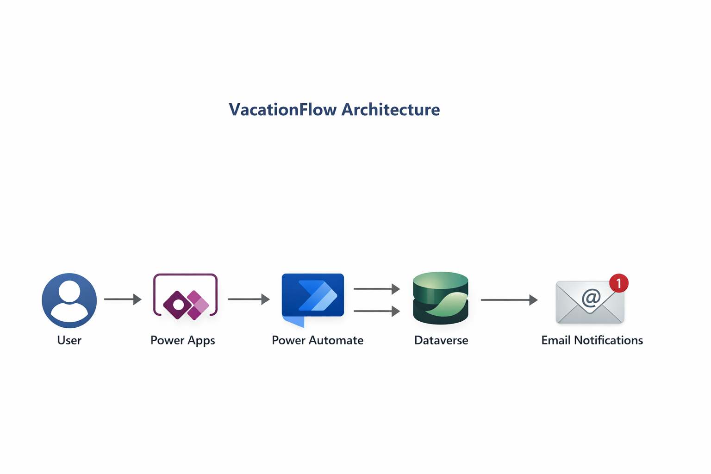

# VacationFlow

## 🚀 Intelligent Vacation Request Automation – Power Platform

---

## 📌 Executive Summary

VacationFlow is a business process automation solution built with Microsoft Power Platform that digitizes and controls the complete vacation request and approval lifecycle within an organization.

It replaces manual email-based or spreadsheet-based processes, providing:

- Automated business rule validation  
- Prevention of overlapping vacation periods  
- Real-time vacation balance control  
- Structured approval workflow  
- Full audit traceability  
- Migration-ready architecture  

This project was developed as a professional portfolio case to demonstrate real-world automation capabilities for business and freelance environments.

**Project Start Date:** February 16, 2026  
**Status:** Done Development  

---

## 🧩 Architecture Overview

VacationFlow is built using the Microsoft Power Platform ecosystem to automate the full lifecycle of vacation requests.

The architecture follows a layered design that separates user interaction, workflow automation, and data persistence.

**Components**

- **Power Apps** provides the user interface where employees submit vacation requests and managers review approvals.
- **Power Automate** executes the approval workflow, applies business rules, and controls all status transitions.
- **Microsoft Dataverse** stores structured data including employees, vacation balances, and request history.
- **Email Notifications** are automatically triggered to inform employees and managers of approval decisions.

This architecture ensures:

- Clear separation of responsibilities
- Automated process control
- Data consistency
- Scalability for enterprise environments

---

## 🔄 Business Rules & Logic

The system applies dual-layer validation (Application + Automation) to ensure data integrity.

Key rules implemented:

- Automatic calculation of requested days  
- Available balance validation  
- Overlapping request prevention  
- Single pending request restriction per employee  
- Minimum 5-day advance submission requirement  
- Balance deduction only upon approval  
- Status transitions controlled exclusively by automated flow  
- Real approver registration for audit traceability  

---

## 🎯 What This Project Demonstrates

This solution showcases the ability to:

- Translate business processes into automated logic  
- Design structured approval workflows  
- Implement redundant validations to prevent manual manipulation  
- Simulate role-based access logic  
- Build scalable, migration-ready architectures  
- Deliver structured technical documentation  

---

## 📋 Covered Scenarios

- Valid request within available balance  
- Automatic rejection for exceeded balance  
- Blocking of overlapping date ranges  
- Blocking of multiple pending requests  
- Approval by manager or administrator  
- Automatic balance update upon approval  
- Complete audit trail recording  

---

## 🛠 Technologies Used

- Microsoft Power Apps (Canvas)  
- Microsoft Power Automate  
- Microsoft Dataverse  
- Excel Online (initial prototype data layer)  
- Gmail (development notification service)   

---

## 📧 Email Service Consideration

Due to Microsoft licensing limitations in the development environment, Gmail was used as the notification service.

The notification layer is modular and can be seamlessly replaced with Outlook or Microsoft Exchange in production environments without affecting core business logic.

---

## 📸 Application Screenshots

Example screens of the application interface can be found in:

`/screenshots`

---

## 📚 Technical Documentation

Detailed workflow and technical explanation available in:

`/docs/Vacation_Workflow.md`

---

## 💼 Ideal Use Case

This solution is ideal for:

- Small and mid-sized businesses without an HR system  
- Organizations managing leave via email or spreadsheets  
- Companies using Microsoft 365 seeking structured internal automation  
- Teams needing traceability without investing in a full HR platform  

---
## Author

**Alina Rodríguez**

Business Process Consultant | Digital Automation Specialist

LinkedIn  
https://www.linkedin.com/in/alinarodriguezglez/ 

---

# 🇪🇸 Versión en Español

## 🚀 Automatización Inteligente de Solicitudes de Vacaciones – Power Platform

---

## 📌 Resumen Ejecutivo

VacationFlow es una solución de automatización desarrollada con Microsoft Power Platform que digitaliza y controla el ciclo completo de solicitud y aprobación de vacaciones dentro de una organización.

Reemplaza procesos manuales basados en correo electrónico o archivos compartidos, proporcionando:

- Validación automática de reglas de negocio  
- Prevención de superposición de periodos  
- Control de saldo en tiempo real  
- Flujo de aprobación estructurado  
- Trazabilidad completa  
- Arquitectura preparada para migración futura  

Este proyecto fue desarrollado como caso profesional de portafolio para demostrar capacidades reales en automatización empresarial.

**Fecha de inicio:** 16 de febrero de 2026  
**Estado:** Desarrollo Terminado  

---

## 🧩 Arquitectura de la Solución

VacationFlow está construido utilizando el ecosistema de Microsoft Power Platform para automatizar el ciclo completo de solicitudes de vacaciones.

La arquitectura sigue un diseño en capas que separa la interacción del usuario, la automatización del flujo de trabajo y la persistencia de datos.

**Componentes**

- **Power Apps** proporciona la interfaz donde los empleados registran solicitudes de vacaciones y los gerentes revisan las aprobaciones.
- **Power Automate** ejecuta el flujo de aprobación, aplica las reglas de negocio y controla las transiciones de estado.
- **Microsoft Dataverse** almacena los datos estructurados como empleados, saldos de vacaciones e historial de solicitudes.
- **Notificaciones por correo** se envían automáticamente para informar a empleados y gerentes sobre las decisiones de aprobación.

Esta arquitectura permite:

- Separación clara de responsabilidades  
- Control automatizado del proceso  
- Consistencia de datos  
- Escalabilidad para entornos empresariales

---

## 🔄 Reglas y Lógica de Negocio

El sistema aplica validaciones en dos niveles (Aplicación + Automatización) para garantizar integridad de datos.

Reglas implementadas:

- Cálculo automático de días solicitados  
- Validación de saldo disponible  
- Prevención de solicitudes superpuestas  
- Restricción de una sola solicitud pendiente por empleado  
- Envío obligatorio con al menos 5 días de anticipación  
- Descuento de saldo únicamente tras aprobación  
- Control total de estados gestionado por el flujo automatizado  
- Registro del aprobador real para trazabilidad  

---

## 🛠 Tecnologías Utilizadas

- Microsoft Power Apps (Canvas)  
- Microsoft Power Automate  
- Microsoft Dataverse  
- Excel Online (capa inicial de datos del prototipo)   
- Gmail (Entorno de desarrollo)  

---

## 📸 Capturas de la Aplicación

Ejemplos de la interfaz disponibles en:

`/screenshots`

---

## 📚 Documentación Técnica

Flujo y explicación técnica detallada en:

`/docs/Vacation_Workflow.md`

---

## 💼 Caso de Uso Ideal

Esta solución es ideal para:

- Pequeñas y medianas empresas sin sistema de Recursos Humanos  
- Organizaciones que gestionan vacaciones por correo o Excel  
- Empresas que utilizan Microsoft 365 y desean automatizar procesos internos  
- Equipos que necesitan control y trazabilidad sin invertir en un sistema HR completo

---

## Autor

**Alina Rodríguez**

Business Process Consultant | Digital Automation Specialist

LinkedIn  
https://www.linkedin.com/in/alinarodriguezglez/
