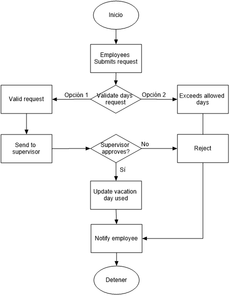
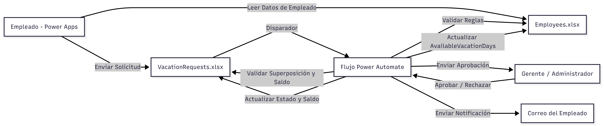
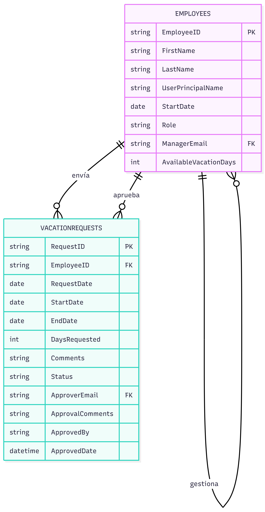

# VacationFlow – Documentación Técnica

## 1. Problema de Negocio

Muchas pequeñas y medianas empresas gestionan las solicitudes de vacaciones de forma manual mediante correos electrónicos o archivos compartidos, lo que genera:
- Falta de visibilidad del estado de las solicitudes
- Riesgo de superposición de periodos aprobados
- Cálculos manuales de saldo de días
- Ausencia de trazabilidad en aprobaciones
- Dependencia de seguimiento individual por parte del gerente

---
## 2. Alcance de la Solución

Esta implementación cubre:

- Solicitud y validación de vacaciones
- Flujo de aprobación jerárquico
- Control de saldo en tiempo real
- Registro de auditoría
- Arquitectura preparada para migración

No incluye:
- Integración directa con sistemas de nómina
- Gestión automática de acumulación anual
- Integración nativa con Azure AD

---

## 3. Reglas de Negocio

- Cada empleado tiene un máximo de 15 días de vacaciones por año.
- Los empleados no pueden tener más de una solicitud de vacaciones pendiente al mismo tiempo.
- Las solicitudes de vacaciones no deben superponerse con ningún período de vacaciones aprobado existente para el mismo empleado.
- Las solicitudes deben enviarse con al menos 5 días de anticipación.
- Los días solicitados no deben exceder el saldo disponible de vacaciones.
- El saldo de vacaciones se descuenta únicamente al aprobarse la solicitud.
- Las solicitudes requieren la aprobación del gerente directo del empleado.
- Un rol de Administrador puede aprobar cualquier solicitud pendiente si el gerente asignado no está disponible.
- Los rechazos requieren un comentario obligatorio.
- Los usuarios no pueden manipular directamente los valores de estado. Los cambios de estado son controlados exclusivamente por el flujo automatizado.
- El sistema registra el aprobador real para trazabilidad de auditoría.

---

## 4. Estructura de Datos (Excel Online)

La solución utiliza Excel Online (OneDrive) como capa de almacenamiento de datos estructurados.  
La arquitectura simula un modelo organizacional real, incluyendo jerarquía y control de acceso basado en roles.

### 📊 Employees.xlsx

| Campo                 | Tipo   | Descripción                                 |
|-----------------------|-------|---------------------------------------------|
| EmployeeID            | Número| Identificador único del Empleado GUID       |
| FirstName             | Texto | Primer nombre del empleado                  |
| LastName              | Texto | Apellido del empleado                       |
| UserPrincipalName     | Texto | Propietario de la solicitud                 |
| StartDate             | Fecha | Fecha de contratación                        |
| Role                  | Texto | Empleado / Gerente / Administrador         |
| ManagerEmail          | Texto | Gerente directo responsable de aprobaciones |
| AvailableVacationDays | Número| Saldo de días de vacaciones disponibles     |

**Razonamiento de diseño**

- Email actúa como identificador único estable.
- Role habilita control de acceso basado en roles (RBAC).
- ManagerEmail permite lógica de aprobación jerárquica sin depender de Azure AD.
- Administrador proporciona capacidad de aprobación de emergencia.
- AvailableVacationDays se actualiza solo después de la aprobación final.
- En un entorno de producción, los roles y la jerarquía se integrarían con grupos de Azure AD.

### 📁 VacationRequests.xlsx

| Campo            | Tipo      | Descripción                                      |
|------------------|----------|--------------------------------------------------|
| RequestID        | Número   | Identificador único de la solicitud GUID         |
| EmployeeID       | Número   | Propietario de la solicitud                      |
| RequestDate      | Fecha    | Fecha en que se hizo la solicitud                |
| StartDate        | Fecha    | Fecha de inicio de vacaciones                    |
| EndDate          | Fecha    | Fecha de fin de vacaciones                       |
| DaysRequested    | Número   | Calculado automáticamente                        |
| Comments         | Texto    | Comentarios del empleado acerca de la solicitud  |
| Status           | Texto    | Pendiente / Aprobada / Rechazada                 |
| ApproverEmail    | Texto    | Gerente asignado                                 |
| ApprovalComments | Texto    | Obligatorio para rechazos                        |
| ApprovedBy       | Texto    | Usuario real que realizó la aprobación/rechazo   |
| ApprovedDate     | FechaHora| Fecha y hora de la acción                        |

**Razonamiento de diseño**

- ApproverEmail define al aprobador principal.
- ApprovedBy asegura trazabilidad de auditoría.
- ApprovedDate proporciona historial rastreable.
- El modelo soporta futuras aprobaciones multinivel mediante un campo `ApprovalStage`.
- La anulación del Administrador no rompe la lógica jerárquica.

---

## 5. Estrategia de Validación

Las validaciones se implementan en **dos niveles** para asegurar la integridad de los datos.

### Capa de Aplicación (Power Apps)

- Validación de envío con 5 días de anticipación.
- Validación de saldo disponible.
- Validación de superposición de fechas.
- Restricción de una sola solicitud pendiente.

**Lógica de superposición:**

StartDate <= ExistingEndDate
AND
EndDate >= ExistingStartDate

---

## 6. Flujo de Aprobación

1. El empleado envía la solicitud.  
2. `DaysRequested` se calcula automáticamente.  
3. `ApproverEmail` se asigna basado en `ManagerEmail`.  
4. `Status` se establece como **Pendiente**.  
5. El gerente o administrador revisa la solicitud.  

### Si se aprueba:

- `Status` = **Aprobada**  
- `ApprovedBy` registrado  
- `ApprovedDate` registrado  
- `AvailableVacationDays` actualizado  

### Si se rechaza:

- `Status` = **Rechazada**  
- `ApprovalComments` obligatorio  
- No se modifica el saldo

---

## 7. Diagrama del Flujo

---

## 8. Modelo de Seguridad

- El acceso basado en roles se simula usando la columna `Role`:
  - **Empleado** → Crear y ver sus propias solicitudes.  
  - **Gerente** → Aprobar solicitudes asignadas.  
  - **Administrador** → Aprobar cualquier solicitud pendiente.  

- En un entorno de producción:
  - Los roles serían gestionados mediante Azure AD.  
  - La jerarquía se recuperaría dinámicamente.  
  - Se podrían implementar aprobaciones multinivel.  

---

## 9. Escenarios de Prueba

| Escenario                             | Comportamiento Esperado   |
|---------------------------------------|--------------------------|
| Solicitud válida dentro del saldo      | Enviada para aprobación  |
| Solicitud excede el saldo              | Rechazo automático       |
| Solicitud se superpone con tiempo aprobado | Bloqueada al enviar     |
| Segundo intento de solicitud pendiente | Bloqueada               |
| Aprobada por gerente                   | Saldo actualizado        |
| Aprobada por administrador             | Anulación registrada     |
| Solicitud rechazada                    | Saldo sin cambios        |

---

## 10. Justificación de Uso de Excel Online

Excel Online fue seleccionado como capa inicial de datos por:

- Disponibilidad inmediata en entornos Microsoft 365 estándar.
- Rapidez para prototipado funcional.
- Facilidad de migración posterior a SharePoint Lists o Dataverse.
- Simplicidad para entornos de pequeñas y medianas empresas.

La arquitectura fue diseñada para permitir migración directa sin alterar la lógica de negocio central.

---

## 11. Migración Futura a SharePoint

Actualmente la solución utiliza Excel Online debido a restricciones de licencia, pero la arquitectura permite migración con mínimo refactorizado.

**Pasos de migración:**

1. Reemplazar `Employees.xlsx` con una lista de SharePoint.  
2. Reemplazar `VacationRequests.xlsx` con una lista de SharePoint.  
3. Actualizar conectores en Power Automate.  
4. Mantener la lógica de negocio existente.  

> Como la validación y el flujo de aprobación no están incrustados en la capa de datos, la migración no afecta el comportamiento central del sistema.

---

## 12. Posibles Personalizaciones para Clientes

La arquitectura permite adaptaciones según las necesidades del cliente, tales como:
- Aprobaciones multinivel.
- Políticas diferenciadas por departamento.
- Integración con calendario de Outlook.
- Migración a SharePoint o Dataverse.
- Panel de reportes con Power BI.
- Interfaz optimizada para dispositivos móviles.
- Notificaciones personalizadas por tipo de solicitud.
- Control de vacaciones acumulables por antigüedad.

---

## 13. Supuestos y Limitaciones

- Se implementa una aprobación de un solo nivel para simplificación.  
- Se puede introducir aprobación multinivel mediante lógica de etapas.  
- Los roles se simulan localmente y no están integrados con Azure AD.  
- Excel Online no proporciona control de concurrencia transaccional.  
- La solución está diseñada como demostración arquitectónica y puede adaptarse a entornos productivos con ajustes en infraestructura y licenciamiento.

---

## 14. Vista General de la Arquitectura

**Descripción de la Arquitectura**

- Power Apps maneja la interacción del usuario y validación de primer nivel.
- Excel Online actúa como almacenamiento de datos estructurado.
- Power Automate aplica reglas de negocio y gestiona el flujo de aprobación.
- Gerentes y administradores interactúan únicamente a través de acciones de aprobación.
- Todas las transiciones de estado son controladas por el flujo automatizado.
- Las notificaciones se envían automáticamente tras aprobación o rechazo.

---

## 15. Diagrama de Relaciones de Entidad (ERD)

**Explicación del Diagrama**

- EmployeeID en VacationRequests vincula las solicitudes al empleado
- ManagerEmail representa una relación jerárquica autorreferenciada.
- ApproverEmail define el gerente asignado.
- ApprovedBy permite trazabilidad de auditoría (aprobador real vs asignado).
- La relación autorreferenciada permite modelar la jerarquía organizacional.

---

## 16. ¿Qué demuestra esta solución?

Este proyecto demuestra la capacidad de:
- Analizar y estructurar procesos de negocio.
- Diseñar reglas de validación en múltiples capas (aplicación y automatización).
- Implementar flujos de aprobación basados en jerarquía.
- Aplicar control de acceso basado en roles (RBAC).
- Garantizar trazabilidad y auditoría de decisiones.
- Diseñar una arquitectura preparada para migración futura.
- Crear soluciones funcionales con bajo costo inicial usando Excel Online.

---

## 17. Enfoque de Implementación

El desarrollo se realizó siguiendo un enfoque estructurado:
- Definición clara de reglas de negocio.
- Diseño del modelo de datos.
- Implementación de validaciones en Power Apps.
- Implementación de controles y flujo de aprobación en Power Automate.
- Pruebas de escenarios críticos.
- Documentación técnica completa para facilitar mantenimiento y migración futura.
