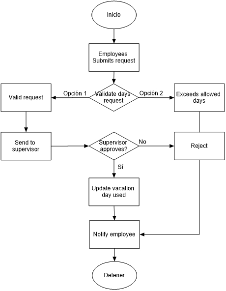
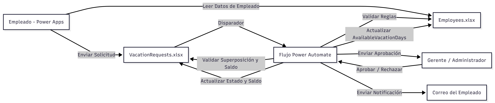
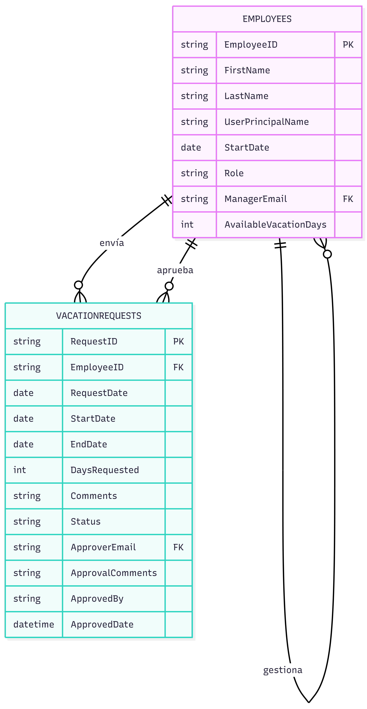

# VacationFlow – Technical Documentation

## 1. Business Problem

Many small and mid-sized organizations manage vacation requests manually through email communication or shared spreadsheets.  
This approach typically results in:

- Limited visibility into request status
- Risk of overlapping approved vacation periods
- Manual calculation of vacation balances
- Lack of traceability in approval decisions
- Dependency on individual managerial follow-up

These limitations introduce operational inefficiencies and increase the likelihood of administrative errors.

---

## 2. Solution Scope

This implementation covers:

- Vacation request submission and validation
- Hierarchical approval workflow
- Real-time vacation balance control
- Audit traceability
- Architecture designed for scalability and data layer migration

Not included in the current implementation:

- Direct payroll system integration
- Automatic yearly vacation accrual
- Native Azure AD organizational hierarchy integration

---

## 3. Data Platform Evolution

The initial version of VacationFlow used **Excel Online (OneDrive)** as the structured data storage layer.  
This approach allowed rapid prototyping within a standard Microsoft 365 environment.

As the project evolved, the solution was migrated to **Microsoft Dataverse** in order to simulate a production-ready architecture and leverage the advanced capabilities of the Power Platform ecosystem.

The migration enabled:

- A **relational data structure**
- Improved **data integrity and consistency**
- Greater **scalability**
- Enhanced **security capabilities**
- Native integration with Power Platform services

Because the system was originally designed with a **clear separation between interface, business logic, and data layer**, the migration required minimal refactoring and did not impact the core business rules or approval workflows.

---

## 4. Business Rules

The system enforces the following operational rules:

- Each employee has a maximum of **15 vacation days per year**.
- Employees cannot have **more than one pending vacation request** at the same time.
- Vacation requests **must not overlap** with previously approved vacation periods.
- Requests must be submitted **at least 5 days in advance**.
- Requested days **cannot exceed the available vacation balance**.
- Vacation balance is **deducted only after approval**.
- Requests must be approved by the **employee’s direct manager**.
- An **Administrator role** can approve any pending request if the assigned manager is unavailable.
- Rejections require a **mandatory comment**.
- Users cannot directly manipulate request status values.
- Status transitions are **controlled exclusively by the automated workflow**.
- The system records the **actual approver** for audit traceability.

---

## 5. Data Structure (Original Excel Prototype)

The initial architecture used Excel Online tables to simulate a structured organizational model including hierarchy and role-based logic.

### 📊 Employees Table

| Field | Type | Description |
|------|------|-------------|
| EmployeeID | Number | Unique employee identifier (GUID) |
| FirstName | Text | Employee first name |
| LastName | Text | Employee last name |
| UserPrincipalName | Text | Owner of the request |
| StartDate | Date | Hiring date |
| Role | Text | Employee / Manager / Administrator |
| ManagerEmail | Text | Direct manager responsible for approvals |
| AvailableVacationDays | Number | Remaining vacation balance |

### Design Rationale

- Email acts as a **stable unique identifier**.
- `Role` enables **role-based access control (RBAC)**.
- `ManagerEmail` supports hierarchical approval logic without Azure AD dependency.
- Administrator role allows **emergency override approval capability**.
- Vacation balance updates only after **final approval**.

### 📁 VacationRequests Table

| Field | Type | Description |
|------|------|-------------|
| RequestID | Number | Unique request identifier |
| EmployeeID | Number | Request owner |
| RequestDate | Date | Request creation date |
| StartDate | Date | Vacation start date |
| EndDate | Date | Vacation end date |
| DaysRequested | Number | Automatically calculated |
| Comments | Text | Employee request comments |
| Status | Text | Pending / Approved / Rejected |
| ApproverEmail | Text | Assigned manager |
| ApprovalComments | Text | Required for rejections |
| ApprovedBy | Text | Actual approver |
| ApprovedDate | DateTime | Timestamp of approval or rejection |

### Design Rationale

- `ApproverEmail` defines the primary approver.
- `ApprovedBy` ensures **audit traceability**.
- `ApprovedDate` provides a **trackable historical record**.
- The model supports **future multi-stage approvals** through a potential `ApprovalStage` field.

---

## 6. Validation Strategy

To guarantee data integrity, validations are implemented across **two independent layers**.

## Application Layer (Power Apps)

Validations performed before submission:

- Minimum 5-day advance notice
- Available vacation balance validation
- Date overlap validation
- Single pending request restriction

### Date Overlap Logic

StartDate <= ExistingEndDate
AND
EndDate >= ExistingStartDate

This ensures vacation periods do not conflict with previously approved requests.

---

## 7. Approval Workflow

1. Employee submits the request.
2. `DaysRequested` is calculated automatically.
3. `ApproverEmail` is assigned based on `ManagerEmail`.
4. Request `Status` is set to **Pending**.
5. Manager or Administrator reviews the request.

### If Approved

- `Status` → **Approved**
- `ApprovedBy` recorded
- `ApprovedDate` recorded
- `AvailableVacationDays` updated

### If Rejected

- `Status` → **Rejected**
- `ApprovalComments` required
- Vacation balance remains unchanged

---

## 7. Workflow Diagram

---

## 9. Security Model

Role-based access control is simulated through the `Role` column.

| Role | Permissions |
|-----|-------------|
| Employee | Create and view own requests |
| Manager | Approve assigned requests |
| Administrator | Approve any pending request |

In a production implementation:

- Roles would be managed through **Azure Active Directory**
- Organizational hierarchy could be retrieved dynamically
- Multi-level approvals could be implemented

---

## 10. Test Scenarios

| Scenario | Expected Behavior |
|--------|------------------|
| Valid request within balance | Sent for approval |
| Request exceeding balance | Automatically blocked |
| Overlapping request | Prevented at submission |
| Second pending request | Blocked |
| Manager approval | Balance updated |
| Administrator approval | Override recorded |
| Rejected request | Balance unchanged |

---

## 11. Architecture Overview

### Architecture Description

- **Power Apps** handles user interaction and first-level validation.
- **Microsoft Dataverse** acts as the primary structured data storage layer.
- **Power Automate** manages business rules and approval workflow.
- Managers and administrators interact only through approval actions.
- All status transitions are controlled by automated workflows.
- Notifications are triggered automatically after approval or rejection.

Excel Online was used during the **initial prototype phase** before migration to Dataverse.

---

## 12. Entity Relationship Diagram (ERD)

### Diagram Explanation

- `EmployeeID` in VacationRequests links requests to employees.
- `ManagerEmail` represents a self-referencing hierarchical relationship.
- `ApproverEmail` defines the assigned manager.
- `ApprovedBy` allows audit traceability between assigned approver and actual approver.

This structure models a simplified organizational hierarchy.

---

## 13. Potential Customizations

The architecture allows multiple client-specific extensions such as:

- Multi-level approvals
- Department-specific vacation policies
- Outlook calendar integration
- Advanced reporting dashboards using Power BI
- Mobile-optimized interface
- Custom notifications per request type
- Vacation accrual rules based on seniority

---

## 14. Assumptions and Limitations

- The current implementation uses **single-level approval** for simplicity.
- Multi-level approval logic can be introduced through workflow stages.
- Roles are simulated locally and not integrated with Azure AD.
- Excel Online does not provide transactional concurrency control.
- The system is designed as an **architectural demonstration** and can be adapted to production environments with appropriate infrastructure and licensing.

---

## # 15. What This Solution Demonstrates

This project demonstrates the ability to:

- Analyze and structure business processes
- Design multi-layer validation strategies
- Implement hierarchical approval workflows
- Apply role-based access control (RBAC)
- Guarantee audit traceability
- Design scalable architectures prepared for migration
- Deliver functional solutions with low initial infrastructure cost

---

## 15. Diagrama de Relaciones de Entidad (ERD)

**Explicación del Diagrama**

- EmployeeID en VacationRequests vincula las solicitudes al empleado
- ManagerEmail representa una relación jerárquica autorreferenciada.
- ApproverEmail define el gerente asignado.
- ApprovedBy permite trazabilidad de auditoría (aprobador real vs asignado).
- La relación autorreferenciada permite modelar la jerarquía organizacional.

---

## 16. Implementation Approach

The development followed a structured methodology:

1. Definition of business rules
2. Data model design
3. Implementation of validations in Power Apps
4. Implementation of approval workflow in Power Automate
5. Testing of critical scenarios
6. Technical documentation for maintainability and future evolution
