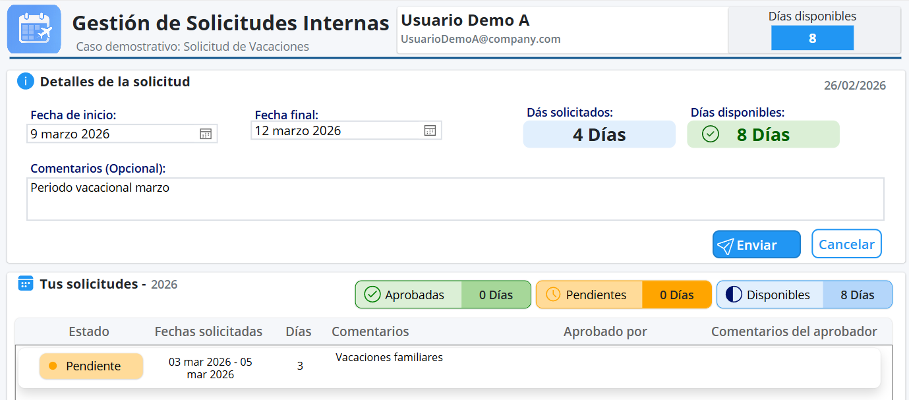
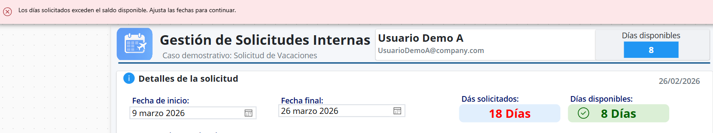
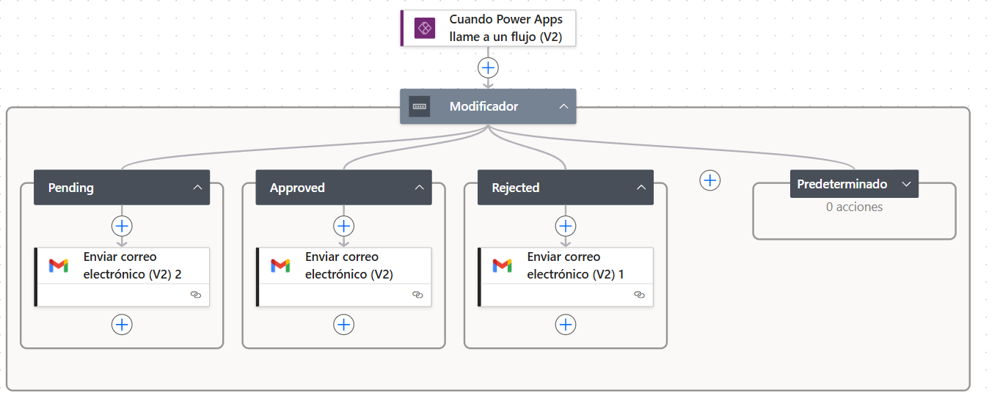
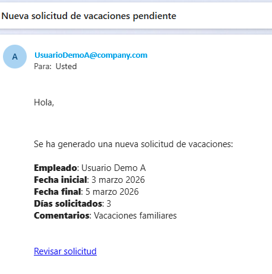
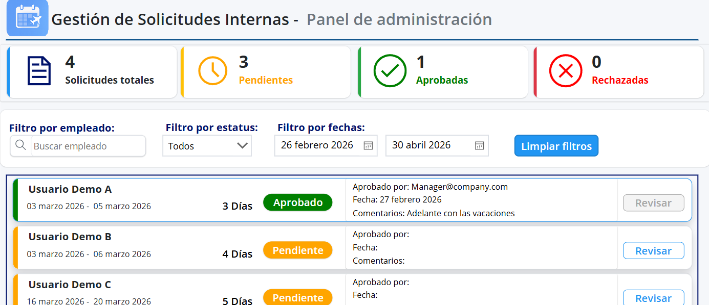
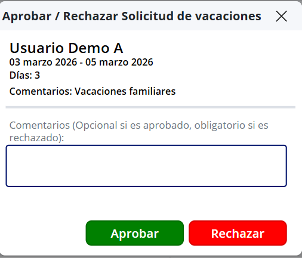
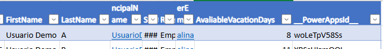
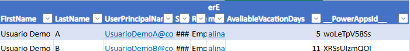

# VacationFlow – Solution Overview
## 🚀 End-to-End Vacation Request Automation

VacationFlow is a solution built with Microsoft Power Platform that automates the complete vacation request management lifecycle within an organization.

The application replaces manual processes based on email communication or shared spreadsheets by introducing business rule validations, automated approval workflows, and consistent data updates.

The result is a structured, traceable, and controlled process from start to finish.

---

## 🗄 Data Platform

The initial version of VacationFlow was developed using Excel Online as the data storage layer, allowing rapid prototyping and simplified development.

As the project evolved, the solution was migrated to Microsoft Dataverse in order to simulate a more production-ready architecture and improve the system’s data model.

This migration enabled:

- A relational data structure
- Improved data integrity and consistency
- Better scalability
- A stronger security model
- Seamless integration with the Microsoft Power Platform ecosystem

Because the solution was originally designed using a modular architecture, the data layer migration was performed without redesigning the business logic or automation flows.

---

## 📌 1. Request Submission

Employees submit vacation requests through a simple and intuitive interface.

The application:

- Automatically calculates the requested days.
- Displays the available vacation balance in real time.
- Applies validations before allowing submission.
- Prevents errors at the beginning of the process.

The focus is on usability and early prevention of inconsistencies.

---

## ⚠️ 2. Business Rule Validation

The solution includes automatic validations that ensure operational consistency:

- Blocking requests that exceed available balance
- Preventing overlapping vacation periods
- Restricting multiple pending requests per employee
- Enforcing a minimum advance notice before submitting requests

These validations reduce manual intervention and avoid administrative rework.

---

## 🔄 3. Automated Approval Workflow

Once a request is submitted, a workflow in Power Automate is triggered that:

- Automatically assigns the request to the appropriate manager
- Sets the initial status to Pending
- Executes conditional logic depending on the decision (Approved / Rejected)
- Sends automated notifications
- Records each action for audit purposes

The flow architecture follows a structured pattern:

**Trigger → Validation → Condition → Action → Update**

---

## 📧 4.Automated Email Notification

The system sends structured email notifications containing:

- Employee information
- Requested dates
- Total requested days
- Comments
- Direct link for review

This ensures immediate communication and timely follow-up.

---

## 📊 5. Administration Dashboard

The administrative panel allows managers or administrators to:

- View key indicators (total requests, pending, approved, rejected)
- Filter by employee, status, or date range
- Review individual requests
- Access the decision module

This provides centralized visibility of the entire process.

---

## 👥 6. Approval / Rejection Screen

From this screen the manager can:

- Approve the request
- Reject it with a mandatory comment
- Record the decision along with date and responsible user

This ensures accountability and traceability.

---

## 📊 7. Automatic Balance Update

When a request is approved:

- The employee vacation balance is updated automatically
- Data consistency between application and data source is maintained
- Accumulated calculations remain accurate

This demonstrates reliable data persistence and synchronization.

---

## 🏢 Use Cases

VacationFlow is particularly useful for:

- Small and medium-sized companies without a formal HR system
- Organizations managing vacation requests through email or spreadsheets
- Businesses using Microsoft 365 seeking internal process automation
- Teams that need traceability without investing in a full HR platform

---

## 🎯 Strategic Value

- Significant reduction of manual errors
- Faster approval cycles
- Real-time visibility of request status
- Auditable record of decisions
- Scalable architecture ready for SharePoint or Dataverse environments

VacationFlow is not just an application, but an automation model that can be adapted to multiple internal business processes.

---
# 🇪🇸 Versión en Español
# VacationFlow – Presentación General

## 🚀 Automatización Integral de Solicitudes de Vacaciones

VacationFlow es una solución desarrollada con Microsoft Power Platform que automatiza el ciclo completo de gestión de vacaciones dentro de una organización.

La aplicación reemplaza procesos manuales basados en correos electrónicos o archivos compartidos, incorporando validaciones de negocio, flujo de aprobación automatizado y actualización consistente de datos.

El resultado es un proceso estructurado, trazable y controlado de principio a fin.

---

## 🗄 Plataforma de Datos

La versión inicial de VacationFlow fue desarrollada utilizando Excel Online como capa de almacenamiento de datos, lo que permitió acelerar el desarrollo y facilitar el prototipado de la solución.

Posteriormente, la solución fue migrada a Microsoft Dataverse para simular un entorno más cercano a producción y mejorar la arquitectura del sistema.

La migración permitió:

- Implementar una estructura de datos relacional
- Mejorar la integridad y consistencia de la información
- Aumentar la escalabilidad de la solución
- Incorporar un modelo de seguridad más robusto
- Facilitar la integración con el ecosistema de Microsoft Power Platform

Gracias a que la solución fue diseñada con una arquitectura modular, la migración de la capa de datos se realizó sin necesidad de rediseñar la lógica de negocio ni los flujos de automatización.

---

## 📌 1. Registro de Solicitud

Los empleados registran sus fechas desde una interfaz clara e intuitiva.

La aplicación:

- Calcula automáticamente los días solicitados.
- Muestra el saldo disponible en tiempo real.
- Aplica validaciones antes de permitir el envío.
- Previene errores desde el origen del proceso.

El enfoque está en usabilidad y prevención temprana de inconsistencias.

---

## ⚠️ 2. Validaciones de Reglas de Negocio

La solución incorpora validaciones automáticas que garantizan coherencia operativa:

- Bloqueo de solicitudes que excedan el saldo disponible.
- Prevención de superposición con vacaciones aprobadas.
- Restricción de múltiples solicitudes pendientes por empleado.
- Control de anticipación mínima requerida para solicitar vacaciones.

Estas validaciones reducen intervención manual y evitan reprocesos administrativos.

---

## 🔄 3. Flujo Automatizado de Aprobación

Una vez enviada la solicitud, se activa un flujo en Power Automate que:

- Asigna automáticamente la solicitud al responsable correspondiente.
- Establece el estatus inicial como **Pendiente**.
- Ejecuta lógica condicional según el resultado (Aprobado / Rechazado).
- Envía notificaciones automatizadas.
- Registra cada acción para fines de auditoría.

La arquitectura del flujo sigue una estructura clara:

**Trigger → Validación → Condición → Acción → Actualización**

---

## 📧 4. Notificación Automática por Correo

El sistema envía notificaciones estructuradas que incluyen:

- Datos del empleado.
- Fechas solicitadas.
- Días totales.
- Comentarios.
- Enlace directo a revisión.

Esto garantiza comunicación inmediata y seguimiento oportuno.

---

## 📊 5. Panel de Administración

El panel permite a administradores:

- Visualizar indicadores clave (totales, pendientes, aprobadas, rechazadas).
- Filtrar por empleado, estatus o rango de fechas.
- Revisar solicitudes individuales.
- Acceder al módulo de decisión.

Ofrece visibilidad centralizada del proceso completo.

---

## 👥 6. Pantalla de Aprobación / Rechazo

Desde esta vista el gerente puede:

- Aprobar la solicitud.
- Rechazarla con comentario obligatorio.
- Registrar la decisión con fecha y usuario responsable.

Esto asegura control, responsabilidad y trazabilidad.

---

## 📊 7. Actualización Automática de Saldo

Cuando una solicitud es aprobada:

- El saldo disponible se actualiza automáticamente.
- Se mantiene consistencia entre aplicación y fuente de datos.
- Se preserva integridad en los cálculos acumulados.

Demuestra persistencia y sincronización de datos.

---

## 🏢 Escenarios de Aplicación

VacationFlow es especialmente útil para:

- Pequeñas y medianas empresas sin sistema formal de Recursos Humanos.
- Organizaciones que gestionan vacaciones mediante correo o Excel manual.
- Empresas que utilizan Microsoft 365 y desean automatizar procesos internos.
- Negocios que buscan trazabilidad sin invertir en un sistema HR completo.

---

## 🎯 Valor Estratégico

- Reducción significativa de errores manuales  
- Disminución de tiempos en aprobaciones  
- Visibilidad en tiempo real del estado de solicitudes  
- Registro auditable de decisiones  
- Arquitectura escalable preparada para migración futura a SharePoint o Dataverse  

VacationFlow no es solo una aplicación, sino un modelo de automatización aplicable a múltiples procesos internos.
